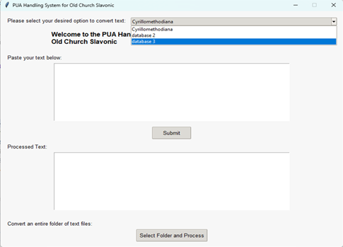
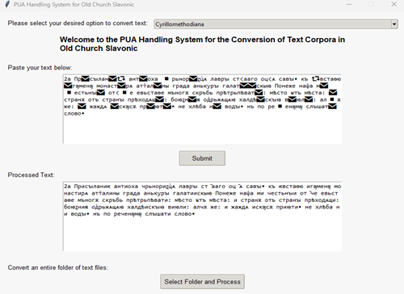
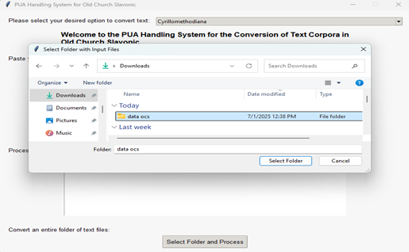
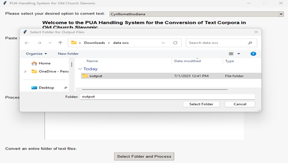

# Converter for Old Church Slavonic

A Windows desktop application for converting Old Church Slavonic text that uses **PUA (Private Use Area)** characters into processed/converted text using selectable mapping databases. It supports both **single text conversion** and **batch conversion of folders**.

## Requirements

- **Python 3.7+**
- **Libraries:**
  - `requests` 
  - `BeautifulSoup4` 
  - `tkinter` 
  - `os`
  - `glob` 

## Installation

Clone or download this repository:

```bash
git clone https://github.com/yourusername/OCS-Text-Processing.git
cd OCS-Text-Processing
```
## Desktop Application
If you prefer to use the desktop application, you can download the executable file for Windows from the link below:

https://drive.google.com/file/d/1N4LZVRcI3K8B_dhJBRp-mAlw6JyYcpNO/view?usp=sharing


## Getting Started
1. Download `Converter/PUA handling system.exe` and save it anywhere (e.g., Desktop).
2. Double-click the `.exe` file to launch the application.
3. If Windows SmartScreen blocks it:
   - Click **More info**
   - Click **Run anyway**
4. The main window titled **“PUA Handling System for Old Church Slavonic”** will open.

---

## How to Use

### 1) Text Conversion (Single Input)
1. **Select Option:** Choose which mapping database to use (e.g., Cyrilmethodiana / Database 2 / Database 3).
2. Paste your PUA text into the **top input box**.
3. Click **Submit**.
4. The converted text appears in the **Processed Text** box.
5. Copy the result:
   - Click inside **Processed Text**
   - Press **Ctrl + A**, then **Ctrl + C**

---

### 2) Convert a Folder of Files (Batch)
1. Click **Select folder and process**.
2. In the first dialog, select the **input folder** containing your PUA text files.
3. In the second dialog, select (or create) the **output folder**.
4. A confirmation pop-up appears when processing is finished.
5. All converted files are saved as **`.txt`** in the output folder.

---

## Interface (Screenshots)

> Place the images in a folder named `interface/` in your repository.

**Main window (database selection + input/output):**  


**Select output folder (where converted `.txt` files will be saved):**  


**Select input folder (folder containing PUA text files):**  


**Example conversion (PUA input → processed output):**  


---


## Contributing
Contributions are welcome! Please open an issue for bugs or feature requests, and submit a pull request if you have improvements to share.
